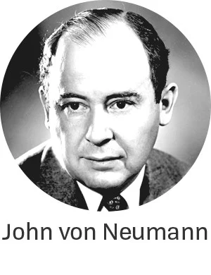
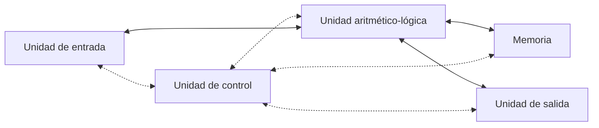
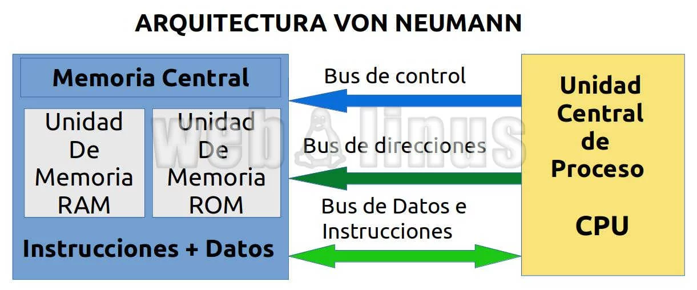
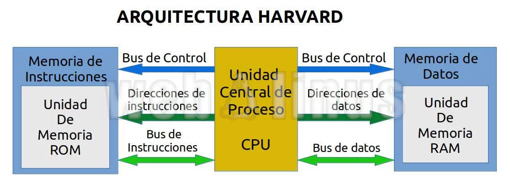
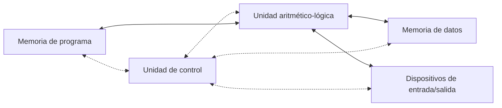

# U1. Arquitectura de Computadoras

## Intro

La tecnología de computadoras ha progresado increíblemente en los últimos cincuenta
años. En 1945 no había computadoras con programa almacenado. Hoy, con menos de mil
principal y más memoria en disco que una computadora que en 1965 costaba un millón de
dólares.

Desde 1985 ha habido una media-docena de nuevas máquinas cuya introducción aparentaba
revolucionar la industria de la informática; sin embargo estas revoluciones sólo fueron
ilusorias, porque alguien más construyó una computadora con un mejor rendimiento.
Los avances en la industria de la computación han producido una nueva revolución, la
revolución de la información que se sitúa a la par con la revolución industrial o con la
revolución agrícola.

Algunas aplicaciones que hace algunas décadas resultaban como parte de la ficción, hoy en
día forman parte de nuestra vida diaria, por ejemplo:

- **Cajeros automáticos:** Una computadora puesta en las paredes de los bancos, para
distribuir y colectar efectivo, era un concepto ridículo en los 1950’s, cuando la
computadora más barata costaba al menos $500, 000.00 dólares y era del tamaño de un
automóvil.

- **Computadoras en los automóviles:** El control por computadora en los automóviles fue
absurdo hasta la década de los 1980’s, cuando los microprocesadores mejoraron
dramáticamente en precio y rendimiento. Actualmente, las computadoras reducen la
contaminación y mejoran la eficiencia del combustible a través del control de inyectores
e incrementan la seguridad por medio de los controles de velocidad y el inflado de
bolsas de aire que protegen a los ocupantes en caso de accidentes.

- **Computadoras portátiles:** Esto sólo podía ocurrir en sueños, sin embargo los avances en
los sistemas de cómputo permiten llevar las computadoras prácticamente a cualquier
sitio.

- **El proyecto del genoma humano:** El costo del equipo de cómputo necesario para
monitorear las secuencias de DNA humano fue de algunos millones de dólares. Es poco
probable que alguien hubiera considerado este proyecto si el costo fuera de 10 a 100
veces más alto, como ocurría hace 15 o 25 años.

- **Internet:** La red de redes, que conecta a millones de computadoras en todo el mundo,
era un concepto de ciencia ficción en los 1960’s. La idea de que la información
pudiera ser enviada a través de una red de computadoras era tan extraña que los
investigadores de la época no podían imaginar cómo se podría hacer.

En la década de los 1960’s y 1970’s, una restricción primaria sobre el rendimiento del
cómputo fue el tamaño de la memoria de las computadoras. Los programadores obedecían a
un credo simple: Al minimizar el espacio de memoria se hacen programas más rápidos. En
la última década, los avances en el diseño de las computadoras y en la tecnología de las
memorias han reducido la importancia de la memoria pequeña.

Los programadores interesados en el rendimiento ahora necesitan entender los tópicos que
han reemplazado al modelo simple de memoria de los 1960’s: La naturaleza jerárquica de
las memorias y la naturaleza paralela de los procesadores. Los programadores que busquen
construir versiones competitivas de compiladores, sistemas operativos, bases de datos, etc.,
deberán contar con conocimientos de la organización de las computadoras.

## Abstracción

Tanto en Hardware como en software encontramos abstracciones, es decir, **un conjunto de
capas jerárquicas donde la capa de un nivel mas bajo oculta detalles a la capa siguiente.**

El principio de abstracción es la forma en que los diseñadores de hardware y software se las
arreglan con la complejidad de los sistemas de cómputo.
Para entender las abstracciones existentes en software, primeramente explicaremos lo que
hay debajo de un programa.

Para “hablarle” a una máquina electrónica, sería necesario enviarle señales eléctricas. Las
señales que las máquinas entienden fácilmente son “encendido” y “apagado”, de modo que
el alfabeto de las máquinas solo se forma por dos letras. Así como las 27 letras del alfabeto
español no nos limitan cuanto puede ser escrito, con las dos letras del alfabeto de las
computadoras no les establece un límite de lo que se puede hacer con ellas. Los dos
símbolos para estas dos letras son los números 0 y 1, por lo que comúnmente consideramos
como el lenguaje de las máquinas a los números en base 2, o números binarios. A cada
“letra” la referimos como un dígito binario o bit.

Las computadoras son esclavas de nuestros comandos; y el nombre de un comando
individual se denomina instrucción. Las instrucciones son una secuencia de bits que la
computadora entiende, pueden ser pensadas como números. Por ejemplo, los bits:

```binary
1000110010100000
```

La programación de computadoras con números binarios es bastante tediosa y expuesta a
errores, por lo que fue necesaria la invención de nuevas notaciones más cercanas a la forma
de pensar de los humanos. Las primeras notaciones se trasladaban a binario a mano, pero
los pioneros de la computación se preguntaron ¿Por qué no utilizar a la máquina para
programar a la máquina?, Pronto se crearon programas encargados de trasladar de notación
simbólica a binario. Al primero de estos programas se le denominó ensamblador. Por
ejemplo, para sumar dos números el programador escribía en notación simbólica:

```assembly
add A, B
```

y el ensamblador lo trasladaría a

```binary
1000110010100000
```

El nombre acuñado para este lenguaje simbólico, aún usado actualmente, es **lenguaje
ensamblador**.

HW 0. - Creación de un conversor de numeros en bases diferentes.

```python
/*
 * Esta funcion
 * @params numero1, base1
 * @returns number base10
 * @example:
   - conversor(12, 12): 20
 */
```

0010b2 -> b10 = 2

El lenguaje ensamblador es un lenguaje de bajo nivel, es decir, está más cerca del lenguaje de las máquinas que del lenguaje de los humanos. A pesar de que el lenguaje ensamblador es más fácil de entender que el binario, sigue siendo muy tedioso y propenso a errores. Por lo que se crearon lenguajes de alto nivel, que son más cercanos al lenguaje humano. Por ejemplo, para sumar dos números en un lenguaje de alto nivel se escribiría:

```python
A + B
```

## 1.1 Modelosde aquitectura de computadoras

- **Arquitecturas clasicas**:
  - [**Arquitectura de von Neumann**](#111-arquitectura-de-von-neumann)
  - [**Arquitectura de Harvard**](#112-arquitectura-de-harvard)
- **Arquitecturas segmentadas**:
  - **Arquitectura de segmentación de instrucciones**
  - **Arquitectura de segmentación de datos**
- **Arquitecturas de multiprocesamiento**:
  - **Arquitectura de multiprocesamiento simétrico**
  - **Arquitectura de multiprocesamiento asimétrico**

### 1.1.1 Arquitectura de von Neumann

La arquitectura von Neumann, también conocida como arquitectura Princeton, es una arquitectura de computadoras descrita en 1945 por el matemático y físico John von Neumann.

John Von Neumann fue un matemático de origen austrohúngaro que durante su vida trabajó con científicos como **Albert Einstein**, **Alan Turing** en el **Instituto de Estudios Avanzados de la Universidad de Princenton** y posteriormente también con **Robert Oppenheimer**. Aparte de desarrollar la arquitectura común de casi todos los procesadores para PCs, trabajó en el **Proyecto Manhattan** donde se desarrolló la bomba atómica.



La arquitectura de von Neumann es un modelo conceptual para diseñar una computadora
digital que utiliza un procesador que ejecuta instrucciones almacenadas en memoria. El
modelo lleva el nombre del matemático y físico húngaro John von Neumann, quien en 1945
propuso el primer diseño de computadora que almacenaba tanto los programas como los
datos en la misma memoria. La arquitectura de von Neumann se basa en las siguientes
características:

- **Unidad de entrada:** Provee las instrucciones y los datos a la computadora.
- **Unidad de control:** Interpreta las instrucciones y controla el flujo de datos entre la
memoria y la unidad aritmético-lógica.
- **Unidad aritmético-lógica (ALU):** Realiza operaciones aritméticas y lógicas bajo la dirección
de la unidad de control.
- **Memoria:** Almacena datos e instrucciones.
- **La unida de salida:** Muestra los resultados de las operaciones realizadas por la
computadora.

Al conjunto constituido por la unidad de control, la ALU y la memoria se le conoce como
la **unidad central de procesamiento (CPU)**. La mayoría de las computadoras modernas
pueden descomponerse en estas cinco partes básicas.



Las flechas indican la dirección de la información, es decir, cómo se mueven los datos, las
lineas punteadas indican rutas de control y las lineas sólidas indican rutas de datos.

El programa almacenado en la memoria es el aspecto más importante de la arquitectura de
von Neumann, ya que permite a la computadora ejecutar instrucciones de forma secuencial.
Antes de la arquitectura de von Neumann, los programas se almacenaban en medios externos
como tarjetas perforadas o cintas magnéticas, lo que hacía que la ejecución de instrucciones
fuera lenta y propensa a errores.

#### Modelo de interconexión a traves de un bus

La arquitectura de von Neumann utiliza un **bus del sistema** para transferir datos entre la
memoria, la unidad de control y la unidad aritmético-lógica. El bus de datos es un conjunto
de cables(circuito) que conecta las diferentes partes de la computadora y permite la transferencia de
datos entre ellas. El bus de datos consta de tres tipos de líneas:

- **Líneas de datos:** Transmiten los datos entre la memoria, la unidad de control y la unidad
aritmético-lógica.
- **Líneas de dirección:** Indican la ubicación de los datos en la memoria.
- **Líneas de control:** Controlan la transferencia de datos entre las diferentes partes de la
computadora.
- **Líneas de alimentación:** Proporcionan energía a los diferentes componentes.



#### Ciclo de instrucción de von Neumann

El ciclo de instrucción de von Neumann es el proceso mediante el cual una computadora
ejecuta instrucciones almacenadas en memoria. El ciclo de instrucción de von Neumann
consta de las siguientes etapas:

1. **Buscar instrucción:** La unidad de control busca la siguiente instrucción en la memoria.
2. **Decodificar instrucción:** La unidad de control decodifica la instrucción y determina
qué operación debe realizar.
3. **Ejecutar instrucción:** La unidad de control ejecuta la instrucción y realiza la operación
correspondiente.
4. **Almacenar resultado:** La unidad de control almacena el resultado de la operación en
la memoria.


El ciclo de instrucción de von Neumann se repite continuamente hasta que se completa el
programa. Cada instrucción se ejecuta de forma secuencial, lo que permite a la computadora
realizar tareas complejas mediante la combinación de instrucciones simples.

#### Ventajas de la arquitectura de von Neumann

- **Simplicidad:** La arquitectura de von Neumann es simple y fácil de entender, lo que
facilita el diseño y la programación de computadoras.
- **Flexibilidad:** La arquitectura de von Neumann permite la ejecución de instrucciones de
forma secuencial, lo que facilita la programación de aplicaciones complejas.
- **Eficiencia:** La arquitectura de von Neumann es eficiente en términos de uso de
recursos, lo que permite una ejecución más o menos rápida de instrucciones.

#### Desventajas de la arquitectura de von Neumann

- **Limitaciones en la longitud de las instrucciones por el bus de datos:** Hace que el microprocesador tenga que realizar varios accesos a memoria para buscar instrucciones complejas.
- **Limitaciones de velocidad:** La arquitectura de von Neumann tiene limitaciones en
términos de velocidad de acceso a la memoria y capacidad de procesamiento, lo que
puede afectar el rendimiento de la computadora.
- **Cuellos de botella:** La arquitectura de von Neumann puede generar cuellos de botella
en el flujo de datos, lo que puede ralentizar la ejecución de instrucciones.
- **Complejidad de programación:** La arquitectura de von Neumann puede ser compleja
de programar, especialmente para aplicaciones paralelas y distribuidas.

La arquitectura de von Neumann es la base de la mayoría de las computadoras modernas,
incluidas las computadoras personales, las estaciones de trabajo y los servidores. Sin
embargo, la arquitectura de von Neumann tiene limitaciones, como la velocidad de acceso a
la memoria y la capacidad de procesamiento. Por esta razón, se han propuesto otros
modelos de arquitectura, como la arquitectura de Harvard, las arquitecturas segmentadas y
de multiprocesamiento.

### 1.1.2 Arquitectura de Harvard

El trabajo realizado en la **Universidad de Harvard** en la década de **1940** bajo el liderazgo de **Howard Aiken** creó una computadora original basada en relés, llamada Harvard Mark I, que es el término de donde surge el concepto de la arquitectura Harvard.


La arquitectura de Harvard es un modelo conceptual para diseñar una computadora digital
que utiliza dos memorias separadas para almacenar datos e instrucciones. La arquitectura de Harvard se basa en las siguientes características:

- **Memoria de programa:** Almacena las instrucciones del programa.
- **Memoria de datos:** Almacena los datos utilizados por el programa.
- **Unidad de control:** Interpreta las instrucciones y controla el flujo de datos entre la
memoria de programa y la memoria de datos.
- **Unidad aritmético-lógica:** Realiza operaciones aritméticas y lógicas.
- **Dispositivos de entrada/salida:** Permiten la comunicación con el mundo exterior.



La arquitectura de Harvard utiliza dos buses separados para transferir datos entre la memoria
de programa y la memoria de datos. El bus de datos se utiliza para transferir datos entre la
memoria de datos y la unidad aritmético-lógica, mientras que el bus de direcciones se utiliza
para transferir direcciones entre la memoria de programa y la unidad de control.



La arquitectura de Harvard tiene la ventaja de permitir el acceso simultáneo a la memoria de
programa y la memoria de datos, lo que mejora el rendimiento de la computadora. La
arquitectura de Harvard se utiliza en sistemas embebidos, como microcontroladores y
sistemas embebidos, donde se requiere un alto rendimiento y una baja latencia.

#### Ciclo de instrucción de Harvard

El ciclo de instrucción de Harvard es similar al ciclo de instrucción de von Neumann, pero
con la diferencia de que utiliza dos buses separados para transferir datos entre la memoria de
programa y la memoria de datos. El ciclo de instrucción de Harvard consta de las siguientes
etapas:

1. **Buscar instrucción:** La unidad de control busca la siguiente instrucción en la memoria
de programa.
2. **Decodificar instrucción:** La unidad de control decodifica la instrucción y determina
qué operación debe realizar.
3. **Ejecutar instrucción:** La unidad de control ejecuta la instrucción y realiza la operación
correspondiente.
4. **Almacenar resultado:** La unidad de control almacena el resultado de la operación en
la memoria de datos.


El ciclo de instrucción de Harvard se repite continuamente hasta que se completa el
programa. Cada instrucción se ejecuta de forma secuencial, lo que permite a la computadora
realizar tareas complejas mediante la combinación de instrucciones simples.

#### Ventajas de la arquitectura de Harvard

- **Rendimiento:** La arquitectura de Harvard permite el acceso simultáneo a la memoria de
programa y la memoria de datos, lo que mejora el rendimiento de la computadora.
- **Eficiencia:** La arquitectura de Harvard es eficiente en términos de uso de recursos, lo
que permite una ejecución más rápida de instrucciones que la arquitectura de von Neumann.
- **Flexibilidad:** La arquitectura de Harvard es flexible y fácil de programar, lo que facilita
la creación de aplicaciones complejas.

#### Desventajas de la arquitectura de Harvard

- **Complejidad:** La arquitectura de Harvard es más compleja que la arquitectura de von
Neumann, lo que puede dificultar el diseño y la programación de computadoras.
- **Costo:** La arquitectura de Harvard puede ser más costosa que la arquitectura de von
Neumann, lo que puede limitar su adopción en sistemas de bajo costo.
- **Limitaciones en la longitud de las instrucciones:** Hace que el microprocesador tenga
que realizar varios accesos a memoria para buscar instrucciones complejas.

El modelo Harvard resulta tener mayor complejidad, sin embargo, al tener los buses de forma independiente se evita el cuello de botella producido por la arquitectura von Neumann.

#### Adiciones a la arquitectura de Harvard

Una adición común es agregar un almacenamiento **caché de instrucciones** al bus de datos del programa, que le permita a la unidad de ejecución de instrucciones un acceso más rápido al siguiente paso del programa, sin tener que ir a una memoria más lenta para obtener el paso del programa cada vez que se requiera.

### 1.2.1 Arquitectura segmentada

La arquitectura segmentada es un modelo conceptual para diseñar una computadora digital
que utiliza múltiples unidades de procesamiento para ejecutar instrucciones de forma
paralela. El modelo se basa en la idea de dividir el proceso de ejecución de instrucciones en
varias etapas, cada una realizada por una unidad de procesamiento diferente. La
arquitectura segmentada se utiliza en sistemas de alto rendimiento, como supercomputadoras
y servidores, donde se requiere un procesamiento rápido y eficiente de instrucciones.

La arquitectura segmentada se divide en dos categorías principales: la arquitectura de
segmentación de instrucciones y la arquitectura de segmentación de datos. La arquitectura
de segmentación de instrucciones divide el proceso de ejecución de instrucciones en
varias etapas, cada una realizada por una unidad de procesamiento diferente. La
arquitectura de segmentación de datos divide el proceso de ejecución de instrucciones en
varias etapas, cada una realizada por una unidad de procesamiento diferente.

#### 1.2.1 Arquitectura de segmentación de instrucciones

La arquitectura de segmentación de instrucciones es un modelo conceptual para diseñar
una computadora digital que utiliza múltiples unidades de procesamiento para ejecutar
instrucciones de forma paralela. El modelo se basa en la idea de dividir el proceso de
ejecución de instrucciones en varias etapas, cada una realizada por una unidad de
procesamiento diferente. La arquitectura de segmentación de instrucciones se utiliza en
sistemas de alto rendimiento, como supercomputadoras y servidores, donde se requiere un
procesamiento rápido y eficiente de instrucciones.

La arquitectura de segmentación de instrucciones tiene la ventaja de permitir una
distribución equitativa de la carga de trabajo entre las unidades de procesamiento, lo que
mejora el rendimiento de la computadora. Sin embargo, la arquitectura de segmentación de
instrucciones también tiene limitaciones, como la complejidad de la programación y la

### 1.3.1 Arquitectura de multiprocesamiento

La arquitectura de multiprocesamiento es un modelo conceptual para diseñar una
computadora digital que utiliza múltiples procesadores para ejecutar instrucciones de forma
paralela. El modelo se basa en la idea de dividir el proceso de ejecución de instrucciones en
varias unidades de procesamiento, cada una realizada por un procesador diferente. La
arquitectura de multiprocesamiento se utiliza en sistemas de alto rendimiento, como
supercomputadoras y servidores, donde se requiere un procesamiento rápido y eficiente de
instrucciones.

La arquitectura de multiprocesamiento se divide en dos categorías principales: la
arquitectura de multiprocesamiento simétrico y la arquitectura de multiprocesamiento
asimétrico.

#### 1.3.1 Arquitectura de multiprocesamiento simétrico

La arquitectura de multiprocesamiento simétrico es un modelo conceptual para diseñar una
computadora digital que utiliza múltiples procesadores idénticos para ejecutar instrucciones
de forma paralela. El modelo se basa en la idea de dividir el proceso de ejecución de
instrucciones en varias unidades de procesamiento, cada una realizada por un procesador
diferente. La arquitectura de multiprocesamiento simétrico se utiliza en sistemas de alto
rendimiento, como supercomputadoras y servidores, donde se requiere un procesamiento
rápido y eficiente de instrucciones.

La arquitectura de multiprocesamiento simétrico tiene la ventaja de permitir una
distribución equitativa de la carga de trabajo entre los procesadores, lo que mejora el
rendimiento de la computadora. Sin embargo, la arquitectura de multiprocesamiento
simétrico también tiene limitaciones, como la complejidad de la programación y la gestión
de la memoria compartida.

#### 1.3.2 Arquitectura de multiprocesamiento asimétrico

La arquitectura de multiprocesamiento asimétrico es un modelo conceptual para diseñar
una computadora digital que utiliza múltiples procesadores diferentes para ejecutar
instrucciones de forma paralela. El modelo se basa en la idea de dividir el proceso de
ejecución de instrucciones en varias unidades de procesamiento, cada una realizada por un
procesador diferente. La arquitectura de multiprocesamiento asimétrico se utiliza en
sistemas de alto rendimiento, como supercomputadoras y servidores, donde se requiere un
procesamiento rápido y eficiente de instrucciones.

La arquitectura de multiprocesamiento asimétrico tiene la ventaja de permitir una
distribución flexible de la carga de trabajo entre los procesadores, lo que mejora el
rendimiento de la computadora. Sin embargo, la arquitectura de multiprocesamiento
asimétrico también tiene limitaciones, como la complejidad de la programación y la gestión
de la memoria compartida.
