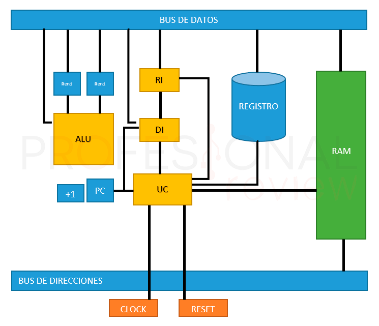

# U1. Arquitectura de Computadoras

## Intro

La tecnología de computadoras ha progresado increíblemente en los últimos cincuenta
años. En 1945 no había computadoras con programa almacenado. Hoy, con menos de mil
principal y más memoria en disco que una computadora que en 1965 costaba un millón de
dólares.

Desde 1985 ha habido una media-docena de nuevas máquinas cuya introducción aparentaba
revolucionar la industria de la informática; sin embargo estas revoluciones sólo fueron
ilusorias, porque alguien más construyó una computadora con un mejor rendimiento.
Los avances en la industria de la computación han producido una nueva revolución, la
revolución de la información que se sitúa a la par con la revolución industrial o con la
revolución agrícola.

Algunas aplicaciones que hace algunas décadas resultaban como parte de la ficción, hoy en
día forman parte de nuestra vida diaria, por ejemplo:

- **Cajeros automáticos:** Una computadora puesta en las paredes de los bancos, para
distribuir y colectar efectivo, era un concepto ridículo en los 1950’s, cuando la
computadora más barata costaba al menos $500, 000.00 dólares y era del tamaño de un
automóvil.

- **Computadoras en los automóviles:** El control por computadora en los automóviles fue
absurdo hasta la década de los 1980’s, cuando los microprocesadores mejoraron
dramáticamente en precio y rendimiento. Actualmente, las computadoras reducen la
contaminación y mejoran la eficiencia del combustible a través del control de inyectores
e incrementan la seguridad por medio de los controles de velocidad y el inflado de
bolsas de aire que protegen a los ocupantes en caso de accidentes.

- **Computadoras portátiles:** Esto sólo podía ocurrir en sueños, sin embargo los avances en
los sistemas de cómputo permiten llevar las computadoras prácticamente a cualquier
sitio.

- **El proyecto del genoma humano:** El costo del equipo de cómputo necesario para
monitorear las secuencias de DNA humano fue de algunos millones de dólares. Es poco
probable que alguien hubiera considerado este proyecto si el costo fuera de 10 a 100
veces más alto, como ocurría hace 15 o 25 años.

- **Internet:** La red de redes, que conecta a millones de computadoras en todo el mundo,
era un concepto de ciencia ficción en los 1960’s. La idea de que la información
pudiera ser enviada a través de una red de computadoras era tan extraña que los
investigadores de la época no podían imaginar cómo se podría hacer.

En la década de los 1960’s y 1970’s, una restricción primaria sobre el rendimiento del
cómputo fue el tamaño de la memoria de las computadoras. Los programadores obedecían a
un credo simple: Al minimizar el espacio de memoria se hacen programas más rápidos. En
la última década, los avances en el diseño de las computadoras y en la tecnología de las
memorias han reducido la importancia de la memoria pequeña.

Los programadores interesados en el rendimiento ahora necesitan entender los tópicos que
han reemplazado al modelo simple de memoria de los 1960’s: La naturaleza jerárquica de
las memorias y la naturaleza paralela de los procesadores. Los programadores que busquen
construir versiones competitivas de compiladores, sistemas operativos, bases de datos, etc.,
deberán contar con conocimientos de la organización de las computadoras.

## Abstracción

Tanto en Hardware como en software encontramos abstracciones, es decir, **un conjunto de
capas jerárquicas donde la capa de un nivel mas bajo oculta detalles a la capa siguiente.**

El principio de abstracción es la forma en que los diseñadores de hardware y software se las
arreglan con la complejidad de los sistemas de cómputo.
Para entender las abstracciones existentes en software, primeramente explicaremos lo que
hay debajo de un programa.

Para “hablarle” a una máquina electrónica, sería necesario enviarle señales eléctricas. Las
señales que las máquinas entienden fácilmente son “encendido” y “apagado”, de modo que
el alfabeto de las máquinas solo se forma por dos letras. Así como las 27 letras del alfabeto
español no nos limitan cuanto puede ser escrito, con las dos letras del alfabeto de las
computadoras no les establece un límite de lo que se puede hacer con ellas. Los dos
símbolos para estas dos letras son los números 0 y 1, por lo que comúnmente consideramos
como el lenguaje de las máquinas a los números en base 2, o números binarios. A cada
“letra” la referimos como un dígito binario o bit.

Las computadoras son esclavas de nuestros comandos; y el nombre de un comando
individual se denomina instrucción. Las instrucciones son una secuencia de bits que la
computadora entiende, pueden ser pensadas como números. Por ejemplo, los bits:

```binary
1000110010100000
```

La programación de computadoras con números binarios es bastante tediosa y expuesta a
errores, por lo que fue necesaria la invención de nuevas notaciones más cercanas a la forma
de pensar de los humanos. Las primeras notaciones se trasladaban a binario a mano, pero
los pioneros de la computación se preguntaron ¿Por qué no utilizar a la máquina para
programar a la máquina?, Pronto se crearon programas encargados de trasladar de notación
simbólica a binario. Al primero de estos programas se le denominó ensamblador. Por
ejemplo, para sumar dos números el programador escribía en notación simbólica:

```assembly
add A, B
```

y el ensamblador lo trasladaría a

```binary
1000110010100000
```

El nombre acuñado para este lenguaje simbólico, aún usado actualmente, es **lenguaje
ensamblador**.

HW 0. - Creación de un conversor de numeros en bases diferentes.

```python
/*
 * Esta funcion
 * @params numero1, base1
 * @returns number base10
 * @example:
   - conversor(12, 12): 20
 */
```

0010b2 -> b10 = 2

El lenguaje ensamblador es un lenguaje de bajo nivel, es decir, está más cerca del lenguaje de las máquinas que del lenguaje de los humanos. A pesar de que el lenguaje ensamblador es más fácil de entender que el binario, sigue siendo muy tedioso y propenso a errores. Por lo que se crearon lenguajes de alto nivel, que son más cercanos al lenguaje humano. Por ejemplo, para sumar dos números en un lenguaje de alto nivel se escribiría:

```python
A + B
```

## 1.1 Modelosde aquitectura de computadoras

- **Arquitecturas clasicas**:
  - [**Arquitectura de von Neumann**](#111-arquitectura-de-von-neumann)
  - [**Arquitectura de Harvard**](#112-arquitectura-de-harvard)
- **Arquitecturas segmentadas**:
  - **Arquitectura de segmentación de instrucciones**
  - **Arquitectura de segmentación de datos**
- **Arquitecturas de multiprocesamiento**:
  - **Arquitectura de multiprocesamiento simétrico**
  - **Arquitectura de multiprocesamiento asimétrico**

### 1.1.1 Arquitectura de von Neumann

La arquitectura von Neumann, también conocida como arquitectura Princeton, es una arquitectura de computadoras descrita en 1945 por el matemático y físico John von Neumann.

John Von Neumann fue un matemático de origen austrohúngaro que durante su vida trabajó con científicos como **Albert Einstein**, **Alan Turing** en el **Instituto de Estudios Avanzados de la Universidad de Princenton** y posteriormente también con **Robert Oppenheimer**. Aparte de desarrollar la arquitectura común de casi todos los procesadores para PCs, trabajó en el **Proyecto Manhattan** donde se desarrolló la bomba atómica.


La arquitectura de von Neumann es un modelo conceptual para diseñar una computadora
digital que utiliza un procesador que ejecuta instrucciones almacenadas en memoria. El
modelo lleva el nombre del matemático y físico húngaro John von Neumann, quien en 1945
propuso el primer diseño de computadora que almacenaba tanto los programas como los
datos en la misma memoria. La arquitectura de von Neumann se basa en las siguientes
características:

- **Unidad de entrada:** Provee las instrucciones y los datos a la computadora.
- **Unidad de control:** Interpreta las instrucciones y controla el flujo de datos entre la
memoria y la unidad aritmético-lógica.
- **Unidad aritmético-lógica (ALU):** Realiza operaciones aritméticas y lógicas bajo la dirección
de la unidad de control.
- **Memoria:** Almacena datos e instrucciones.
- **La unida de salida:** Muestra los resultados de las operaciones realizadas por la
computadora.

Al conjunto constituido por la unidad de control, la ALU y la memoria se le conoce como
la **unidad central de procesamiento (CPU)**. La mayoría de las computadoras modernas
pueden descomponerse en estas cinco partes básicas.


Las flechas indican la dirección de la información, es decir, cómo se mueven los datos, las
lineas punteadas indican rutas de control y las lineas sólidas indican rutas de datos.

El programa almacenado en la memoria es el aspecto más importante de la arquitectura de
von Neumann, ya que permite a la computadora ejecutar instrucciones de forma secuencial.
Antes de la arquitectura de von Neumann, los programas se almacenaban en medios externos
como tarjetas perforadas o cintas magnéticas, lo que hacía que la ejecución de instrucciones
fuera lenta y propensa a errores.

#### Modelo de interconexión a traves de un bus

La arquitectura de von Neumann utiliza un **bus del sistema** para transferir datos entre la
memoria, la unidad de control y la unidad aritmético-lógica. El bus de datos es un conjunto
de cables(circuito) que conecta las diferentes partes de la computadora y permite la transferencia de
datos entre ellas. El bus de datos consta de tres tipos de líneas:

- **Líneas de datos:** Transmiten los datos entre la memoria, la unidad de control y la unidad
aritmético-lógica.
- **Líneas de dirección:** Indican la ubicación de los datos en la memoria.
- **Líneas de control:** Controlan la transferencia de datos entre las diferentes partes de la
computadora.
- **Líneas de alimentación:** Proporcionan energía a los diferentes componentes.


#### Ciclo de instrucción de von Neumann

El ciclo de instrucción de von Neumann es el proceso mediante el cual una computadora
ejecuta instrucciones almacenadas en memoria. El ciclo de instrucción de von Neumann
consta de las siguientes etapas:

1. **Buscar instrucción:** La unidad de control busca la siguiente instrucción en la memoria.
2. **Decodificar instrucción:** La unidad de control decodifica la instrucción y determina
qué operación debe realizar.
3. **Ejecutar instrucción:** La unidad de control ejecuta la instrucción y realiza la operación
correspondiente.
4. **Almacenar resultado:** La unidad de control almacena el resultado de la operación en
la memoria.


El ciclo de instrucción de von Neumann se repite continuamente hasta que se completa el
programa. Cada instrucción se ejecuta de forma secuencial, lo que permite a la computadora
realizar tareas complejas mediante la combinación de instrucciones simples.

#### Ventajas de la arquitectura de von Neumann

- **Simplicidad:** La arquitectura de von Neumann es simple y fácil de entender, lo que
facilita el diseño y la programación de computadoras.
- **Flexibilidad:** La arquitectura de von Neumann permite la ejecución de instrucciones de
forma secuencial, lo que facilita la programación de aplicaciones complejas.
- **Eficiencia:** La arquitectura de von Neumann es eficiente en términos de uso de
recursos, lo que permite una ejecución más o menos rápida de instrucciones.

#### Desventajas de la arquitectura de von Neumann

- **Limitaciones en la longitud de las instrucciones por el bus de datos:** Hace que el microprocesador tenga que realizar varios accesos a memoria para buscar instrucciones complejas.
- **Limitaciones de velocidad:** La arquitectura de von Neumann tiene limitaciones en
términos de velocidad de acceso a la memoria y capacidad de procesamiento, lo que
puede afectar el rendimiento de la computadora.
- **Cuellos de botella:** La arquitectura de von Neumann puede generar cuellos de botella
en el flujo de datos, lo que puede ralentizar la ejecución de instrucciones.
- **Complejidad de programación:** La arquitectura de von Neumann puede ser compleja
de programar, especialmente para aplicaciones paralelas y distribuidas.

La arquitectura de von Neumann es la base de la mayoría de las computadoras modernas,
incluidas las computadoras personales, las estaciones de trabajo y los servidores. Sin
embargo, la arquitectura de von Neumann tiene limitaciones, como la velocidad de acceso a
la memoria y la capacidad de procesamiento. Por esta razón, se han propuesto otros
modelos de arquitectura, como la arquitectura de Harvard, las arquitecturas segmentadas y
de multiprocesamiento.

### 1.1.2 Arquitectura de Harvard

El trabajo realizado en la **Universidad de Harvard** en la década de **1940** bajo el liderazgo de **Howard Aiken** creó una computadora original basada en relés, llamada Harvard Mark I, que es el término de donde surge el concepto de la arquitectura Harvard.


La arquitectura de Harvard es un modelo conceptual para diseñar una computadora digital
que utiliza dos memorias separadas para almacenar datos e instrucciones. La arquitectura de Harvard se basa en las siguientes características:

- **Memoria de programa:** Almacena las instrucciones del programa.
- **Memoria de datos:** Almacena los datos utilizados por el programa.
- **Unidad de control:** Interpreta las instrucciones y controla el flujo de datos entre la
memoria de programa y la memoria de datos.
- **Unidad aritmético-lógica:** Realiza operaciones aritméticas y lógicas.
- **Dispositivos de entrada/salida:** Permiten la comunicación con el mundo exterior.


La arquitectura de Harvard utiliza dos buses separados para transferir datos entre la memoria
de programa y la memoria de datos. El bus de datos se utiliza para transferir datos entre la
memoria de datos y la unidad aritmético-lógica, mientras que el bus de direcciones se utiliza
para transferir direcciones entre la memoria de programa y la unidad de control.


La arquitectura de Harvard tiene la ventaja de permitir el acceso simultáneo a la memoria de
programa y la memoria de datos, lo que mejora el rendimiento de la computadora. La
arquitectura de Harvard se utiliza en sistemas embebidos, como microcontroladores y
sistemas embebidos, donde se requiere un alto rendimiento y una baja latencia.

#### Ciclo de instrucción de Harvard

El ciclo de instrucción de Harvard es similar al ciclo de instrucción de von Neumann, pero
con la diferencia de que utiliza dos buses separados para transferir datos entre la memoria de
programa y la memoria de datos. El ciclo de instrucción de Harvard consta de las siguientes
etapas:

1. **Buscar instrucción:** La unidad de control busca la siguiente instrucción en la memoria
de programa.
2. **Decodificar instrucción:** La unidad de control decodifica la instrucción y determina
qué operación debe realizar.
3. **Ejecutar instrucción:** La unidad de control ejecuta la instrucción y realiza la operación
correspondiente.
4. **Almacenar resultado:** La unidad de control almacena el resultado de la operación en
la memoria de datos.


El ciclo de instrucción de Harvard se repite continuamente hasta que se completa el
programa. Cada instrucción se ejecuta de forma secuencial, lo que permite a la computadora
realizar tareas complejas mediante la combinación de instrucciones simples.

#### Ventajas de la arquitectura de Harvard

- **Rendimiento:** La arquitectura de Harvard permite el acceso simultáneo a la memoria de
programa y la memoria de datos, lo que mejora el rendimiento de la computadora.
- **Eficiencia:** La arquitectura de Harvard es eficiente en términos de uso de recursos, lo
que permite una ejecución más rápida de instrucciones que la arquitectura de von Neumann.
- **Flexibilidad:** La arquitectura de Harvard es flexible y fácil de programar, lo que facilita
la creación de aplicaciones complejas.

#### Desventajas de la arquitectura de Harvard

- **Complejidad:** La arquitectura de Harvard es más compleja que la arquitectura de von
Neumann, lo que puede dificultar el diseño y la programación de computadoras.
- **Costo:** La arquitectura de Harvard puede ser más costosa que la arquitectura de von
Neumann, lo que puede limitar su adopción en sistemas de bajo costo.
- **Limitaciones en la longitud de las instrucciones:** Hace que el microprocesador tenga
que realizar varios accesos a memoria para buscar instrucciones complejas.

El modelo Harvard resulta tener mayor complejidad, sin embargo, al tener los buses de forma independiente se evita el cuello de botella producido por la arquitectura von Neumann.

#### Adiciones a la arquitectura de Harvard

Una adición común es agregar un almacenamiento **caché de instrucciones** al bus de datos del programa, que le permita a la unidad de ejecución de instrucciones un acceso más rápido al siguiente paso del programa, sin tener que ir a una memoria más lenta para obtener el paso del programa cada vez que se requiera.

### 1.2.1 Arquitectura segmentada

La arquitectura segmentada es un modelo conceptual para diseñar una computadora digital
que utiliza múltiples unidades de procesamiento para ejecutar instrucciones de forma
paralela. El modelo se basa en la idea de dividir el proceso de ejecución de instrucciones en
varias etapas, cada una realizada por una unidad de procesamiento diferente. La
arquitectura segmentada se utiliza en sistemas de alto rendimiento, como supercomputadoras
y servidores, donde se requiere un procesamiento rápido y eficiente de instrucciones.

La arquitectura segmentada se divide en dos categorías principales: la arquitectura de
segmentación de instrucciones y la arquitectura de segmentación de datos. La arquitectura
de segmentación de instrucciones divide el proceso de ejecución de instrucciones en
varias etapas, cada una realizada por una unidad de procesamiento diferente. La
arquitectura de segmentación de datos divide el proceso de ejecución de instrucciones en
varias etapas, cada una realizada por una unidad de procesamiento diferente.

#### 1.2.1 Arquitectura de segmentación de instrucciones

La arquitectura de segmentación de instrucciones es un modelo conceptual para diseñar
una computadora digital que utiliza múltiples unidades de procesamiento para ejecutar
instrucciones de forma paralela. El modelo se basa en la idea de dividir el proceso de
ejecución de instrucciones en varias etapas, cada una realizada por una unidad de
procesamiento diferente. La arquitectura de segmentación de instrucciones se utiliza en
sistemas de alto rendimiento, como supercomputadoras y servidores, donde se requiere un
procesamiento rápido y eficiente de instrucciones.

La arquitectura de segmentación de instrucciones tiene la ventaja de permitir una
distribución equitativa de la carga de trabajo entre las unidades de procesamiento, lo que
mejora el rendimiento de la computadora. Sin embargo, la arquitectura de segmentación de
instrucciones también tiene limitaciones, como la complejidad de la programación y la

### 1.3.1 Arquitectura de multiprocesamiento

La arquitectura de multiprocesamiento es un modelo conceptual para diseñar una
computadora digital que utiliza múltiples procesadores para ejecutar instrucciones de forma
paralela. El modelo se basa en la idea de dividir el proceso de ejecución de instrucciones en
varias unidades de procesamiento, cada una realizada por un procesador diferente. La
arquitectura de multiprocesamiento se utiliza en sistemas de alto rendimiento, como
supercomputadoras y servidores, donde se requiere un procesamiento rápido y eficiente de
instrucciones.

La arquitectura de multiprocesamiento se divide en dos categorías principales: la
arquitectura de multiprocesamiento simétrico y la arquitectura de multiprocesamiento
asimétrico.


#### 1.3.1 Arquitectura de multiprocesamiento simétrico

La arquitectura de multiprocesamiento simétrico es un modelo conceptual para diseñar una
computadora digital que utiliza múltiples procesadores idénticos para ejecutar instrucciones
de forma paralela. El modelo se basa en la idea de dividir el proceso de ejecución de
instrucciones en varias unidades de procesamiento, cada una realizada por un procesador
diferente. La arquitectura de multiprocesamiento simétrico se utiliza en sistemas de alto
rendimiento, como supercomputadoras y servidores, donde se requiere un procesamiento
rápido y eficiente de instrucciones.

La arquitectura de multiprocesamiento simétrico tiene la ventaja de permitir una
distribución equitativa de la carga de trabajo entre los procesadores, lo que mejora el
rendimiento de la computadora. Sin embargo, la arquitectura de multiprocesamiento
simétrico también tiene limitaciones, como la complejidad de la programación y la gestión
de la memoria compartida.

#### 1.3.2 Arquitectura de multiprocesamiento asimétrico

La arquitectura de multiprocesamiento asimétrico es un modelo conceptual para diseñar
una computadora digital que utiliza múltiples procesadores diferentes para ejecutar
instrucciones de forma paralela. El modelo se basa en la idea de dividir el proceso de
ejecución de instrucciones en varias unidades de procesamiento, cada una realizada por un
procesador diferente. La arquitectura de multiprocesamiento asimétrico se utiliza en
sistemas de alto rendimiento, como supercomputadoras y servidores, donde se requiere un
procesamiento rápido y eficiente de instrucciones.

La arquitectura de multiprocesamiento asimétrico tiene la ventaja de permitir una
distribución flexible de la carga de trabajo entre los procesadores, lo que mejora el
rendimiento de la computadora. Sin embargo, la arquitectura de multiprocesamiento
asimétrico también tiene limitaciones, como la complejidad de la programación y la gestión
de la memoria compartida.

#### Ventajas de la arquitectura de multiprocesamiento

- **Rendimento**: La arquitectura de multiprocesamiento permite la ejecución de instrucciones de forma paralela, lo que mejora el rendimiento de la computadora.

- **Escalabilidad**: La arquitectura de multiprocesamiento es escalable, lo que permite agregar más procesadores para aumentar la capacidad de procesamiento.

- **Potencia de calculo**: La arquitectura de multiprocesamiento permite la ejecución de tareas complejas en paralelo, lo que aumenta la potencia de cálculo de la computadora.

### Clasificación de los multiprocesadores

Los multiprocesadores se clasifican de acuerdo a la clasificación de arquitecturas  paralelas propuesto por Flynn, (Michael J. Flynn en 1972), en el cual se toman como componentes el flujo de instrucciones y la cantidad de datos, creando los siguientes elementos:

- SI.- Flujo de instrucciones simple
- MI.- Flujo de instrucciones multiple
- SD.- Un dato simple
- MD.- Datos multiples

**Con lo cual se produce la siguiente clasificación:**

- SISD: Sistemas monoprocesador. Tienen un único procesador y ejecutan una sola
instrucción a la vez.

  ```mermaid
  graph LR
    A[Unidad de control] -->|Instrucciones| B[Unidad aritmético-lógica]
    C[Memoria] -->|Datos| B
    B --> D[Unidad de salida]
  ```

- SIMD: Sistemas vectoriales en los que una instrucción puede operar sobre diferentes datos en diferentes procesadores. En esta arquitectura se tienen p procesadores
idénticos, los cuales poseen una memoria local.
Trabajan bajo un solo flujo de instrucciones originado
por una unidad central de control, por lo que se
tienen p flujos de datos.
  
  ```mermaid
  graph LR
    A[Unidad de control] -->|Instrucciones| B[Unidad aritmético-lógica 1]
    A -->|Instrucciones| C[Unidad aritmético-lógica 2]
    A -->|Instrucciones| D[Unidad aritmético-lógica 3]
    E[Memoria compartida] -->|Datos 1| B
    E -->|Datos 2| C
    E -->|Datos 3| D
    B --> F[Unidad de salida]
    C --> F
    D --> F
  ```

- MISD.- En este esquema multiples instrucciones operan sobre un mismo conjunto de datos.

  ```mermaid
  graph LR
    A[Unidad de control 1] -->|Instrucciones 1| B[Unidad aritmético-lógica 1] <-->|Datos| G[Datos compartidos]
    C[Unidad de control 2] -->|Instrucciones 2| E[Unidad aritmético-lógica 2] <-->|Datos| G
    D[Unidad de control 3] -->|Instrucciones 3| F[Unidad aritmético-lógica 3] <-->|Datos| G
    B --> H[Unidad de salida]
    E --> H
    F --> H
  ```

- MIMD.- Estos incluyen a la mayoría de los multiprocesadores. Está conformada por p procesadores, p flujos de instrucciones y p flujos de datos. Cada procesador
trabaja de modo asíncrono bajo el control de un flujo de instrucciones proveniente de su propia unidad de control.

  ```mermaid
  graph LR
    A[Unidad de control 1] -->|Instrucciones 1| B[Unidad aritmético-lógica 1] <-->|Datos 1| G[Memoria compartida]
    C[Unidad de control 2] -->|Instrucciones 2| E[Unidad aritmético-lógica 2] <-->|Datos 2| G
    D[Unidad de control 3] -->|Instrucciones 3| F[Unidad aritmético-lógica 3] <-->|Datos 3| G
    B --> H[Unidad de salida]
    E --> H
    F --> H
  ```

**Los multiprocesadores del modelo MIMD pueden ser clasificados a su vez en:**

- Fuertemente acoplados.- Cuando existe memoria global
- Débilmente acoplados.- Cuando en lugar de memoria global se usa memoria privada

Una memoria global indica que todos los procesadores acceden a una misma memoria común, mientras que la memoria privada indica que cada procesador posee su propia memoria y que ninguno de los procesadores  tiene acceso a la memoria de otro procesador

#### Como comparten los datos los multiprocesadores

- **Memoria compartida:** Todos los procesadores comparten un espacio de memoria común, lo que permite a los procesadores comunicarse entre sí mediante la lectura y escritura de datos en la memoria compartida.


- **Memoria distribuida:** Cada procesador tiene su propia memoria local y se comunica con otros procesadores mediante mensajes, lo que permite una comunicación más eficiente entre los procesadores.


- **Memoria híbrida:** Combina las características de la memoria compartida y la memoria distribuida, lo que permite a los procesadores comunicarse entre sí mediante la lectura y escritura de datos en la memoria compartida y mediante mensajes.


## 1.2 Análisis de componentes

### Introducción

En 1960 Robert Noyce (12/12/1927 - 03/06/1990), creó patentó el primer circuito integrado, el cual se basaba en la idea de Jack Kilby, quien había creado un circuito integrado en 1958. Este invento permitió la creación de los microprocesadores, los cuales son la base de la informática moderna. Fue co-foundador de **Fairchild Semiconductor** en 1957 e **Intel Corporation** en 1968.


En 1967, Marcian Edward Hoff decidió dejar el mundo académico, tras haber completado su PhD en ingeniería eléctrica en la Universidad de Stanford, para unirse a **Intel Corporation**, cuenta que fue el empleado #12 de Intel. En Intel, Hoff se convirtió en el director de la división de aplicaciones de circuitos integrados.

Busicom, una empresa de productos electrónicos japonesa los contactó, requería algo que hiciera funcionar a una nueva línea de calculadoras y requería un sistema que usara 12 circuitos integrados distintos.

Hoff le apostó a mejorar la idea acomodando la mayoría de las funciones en una sola unidad procesadora central. En 1969, Hoff lideró un equipo de ingenieros junto a Federico Faggin, y Stanley Mazor y desarrollaron el primer microprocesador de la historia, el **Intel 4004**.


El microprocesador ha sido la pieza clave en la informática tal y como la conocemos en la actualidad, pues se trata de toda una obra de arte en cuyo interior se esconden miles de millones de circuitos eléctricos, los cuales se llaman transistores o permiten ejecutar una enorme cantidad de operaciones por segundo.

#### Intel 4004

En 1971, Intel lanzó el primer microprocesador, el **Intel 4004**, era de 4 bits, tenía 2,300 transistores y podía realizar 60,000 operaciones por segundo, manejaba 640 bytes de memoria, tenia 16 pines y trabajaba a una velocidad de 740 kHz (0.00074 GHz) y ofrecía ocho ciclos de reloj por ciclo de instrucción, lo que significa que el chip era capaz de ejecutar hasta 92,600 instrucciones por segundo.

El Intel 4004 usaba la avanzada tecnología PMOS(p-channel metal-oxide-semiconductor), una técnica que Faggin perfeccionó en Fairchild Semiconductor en 1968 y que supuso el primer proceso de óxido de metal (MOS) del mundo. Este avance permitió al 4004 incluir 2.300 transistores en un tamaño de función de 10 micras.


#### Intel 8008

En abril de 1972, se anunció el Intel 8008, un microprocesador de 8 bits, una versión más evolucionada del microprocesador anterior para mejorar sus capacidades, este modelo logró multiplicar por dos el número de transistores de su predecesor para alcanzar los 3500 transistores. Este segundo procesador podría procesar nada menos que 200,000 operaciones por segundo y direccionar 16Kb de memoria, fue el primero diseñado para uso general. Las grandes capacidades de este chip hicieron que Intel lograra vender decenas de miles de unidades en pocos meses, dando la posibilidad a muchos usuarios de tener su primer PC.


#### Intel 8086

En 1978, Intel lanzó el **Intel 8086**, el primer microprocesador de 16 bits, el cual fue el precursor de la arquitectura x86 que se utiliza en la mayoría de las computadoras personales. El 8086 tenía 29,000 transistores, trabajaba a una velocidad de 5 MHz y podía direccionar hasta 1 MB de memoria.


#### Intel 80386

En 1985, Intel lanzó el **Intel 80386**, el primer microprocesador de 32 bits, el cual fue el precursor de la arquitectura x86 de 32 bits que se utiliza en la mayoría de las computadoras personales. El 80386 tenía 275,000 transistores, trabajaba a una velocidad de 16 MHz y podía direccionar hasta 4 GB de memoria virtual.


#### Procesador actual


#### Ley de Moore

En 1965, Gordon Moore, co-fundador de Intel, predijo que la cantidad de transistores en un microprocesador se duplicaría cada dos años, lo que se conoce como la **Ley de Moore**. La Ley de Moore ha sido una guía para la industria de los semiconductores durante más de 50 años y ha impulsado la innovación en la fabricación de microprocesadores.


##### Ejemplo de la Ley de Moore

Sitúese en 1971 y dispóngase a escuchar una ópera en un auditorio que tiene un aforo de **2.300** personas, exactamente el mismo número de transistores que integraba el primer microprocesador fabricado por Intel ese año, el 4004.

- **1971 - Intel 4004**: 2300 transistores
- **1973 - Intel 8008**: 3500 transistores
- **1978 - Intel 8086**: 29,000 transistores
- **1985 - Intel 80386**: 275,000 transistores
- **1993 - Intel Pentium**: 3,100,000 transistores
- **1999 - Intel Pentium III**: 24,000,000 transistores
- **2000 - Intel Pentium 4**: 42,000,000 transistores
- **2006 - Intel Core 2 Duo**: 291,000,000 transistores
- **2010 - Intel Core i7**: 1,160,000,000 transistores
- **2017 - Intel Core i9**: 3,300,000,000 transistores
- **2021 - Bionic A15 (iPhone 13)**: 15,000,000,000 transistores

Poblacion actual de la tierra: 7,900,000,000 - 8,000,000,000 de personas

### 1.2.1 CPU (Unidad Central de Procesamiento)

La CPU es el componente principal de una computadora, es un componente electrónico en forma de chip de silicio que se encarga de procesar las instrucciones y los datos de un programa.


#### La CPU consta de las siguientes partes


- **Unidad de control (UC)**: es el elemento que se encarga de impartir las órdenes mediante las señales de control, por ejemplo, el reloj. Busca las instrucciones en la memoria principal y las pasa al decodificador de instrucciones para que se ejecuten. Partes internas:
  - **Reloj**: genera una onda cuadrada para sincronizar las operaciones del procesador
  - **Contador de programa**: contiene la dirección de memoria de la siguiente instrucción que se va a ejecutar
  - **Registro de instrucciones**: contiene la instrucción que se está ejecutando actualmente
  - **Secuenciador**: genera ordenes elementales para el procesamiento de la instrucción.
  - **Decodificador de instrucciones (DI)**: se encarga de interpretar y ejecutar las instrucciones que llegan, extrayendo el código de operación de la instrucción.

  

- **Unidad aritmético lógica (ALU)**: se encarga de hacer los cálculos aritméticos (SUMA, RESTA, MULTIPLICACION, DIVISION) y operaciones lógicas (AND, OR, …). Partes internas.
  - **Circuito operacional**: contienen los multiplexores y circuitos para hacer operaciones.
  - **Registros de entrada**: se almacenan los datos y operado antes de entrar al circuito operacional
  - **Acumulador**: almacena los resultados de las operaciones realizadas
  - **Registro de estado (Flag)**: almacena ciertas condiciones que deben ser tenidas en cuenta en operaciones posteriores.

  

- **Unidad de coma flotante (FPU)**: este elemento no estaba en el diseño original de la arquitectura, posteriormente fue introducido cuando las instrucciones y cálculos se hicieron más complejos con la aparición de los programas representados gráficamente. Esta unidad se encarga de realizar las operaciones en coma flotante, es decir, números reales.

- **Banco de registros y la memoria caché (Cache)**: los procesadores actuales cuentan con una memoria volátil que hace de puente desde la memoria RAM hasta la CPU. Esta es mucho más rápida que la memoria RAM y se encarga de acelerar los accesos del microprocesador a la memoria principal.


- **Bus frontal (Front Side Bus, FSB)**: También se conoce como bus de datos, bus principal o bus de sistema. Es la vía o canal que comunica el microprocesador con la placa base, concretamente con el chip llamado puente norte o nothbridge. Este se encarga de controlar el funcionamiento del bus principal de la CPU, la RAM y los puertos d expansión como son los PCI-Express.Los términos utilizados para definir a este bus son “Quick Path Interconnect” para Intel y “Hypertransport” para AMD.


- **Bus trasero (Back Side BUS, BSB)**: este bus comunica la memoria cache de nivel 2 (L2) con el procesador, siempre y cuando esta no esté integrada en el propio núcleo de la CPU. En la actualidad todos los microprocesadores disponen de memoria cache integrada en el propio chip, por lo que este bus también forma parte del mismo chip.

##### Microprocesador de dos o más núcleos

En un mismo procesador no solamente tendremos estos elementos distribuidos en su interior, sino que además ahora se encuentran replicados. Dispondremos de varios núcleos de procesamiento o lo que es lo mismo varios microprocesadores dentro de la unidad. Cada uno de estos contará con su propia memoria caché L1 y L2, normalmente la L3 se reparte entre ellos, a pares o en conjunto.

Además de esto contaremos con una ALU, UC, DI y FPU para cada uno de los núcleos por lo que la velocidad y capacidad de procesamiento se multiplican en función de la cantidad de núcleos que tenga. También aparecen nuevos elementos dentro de los microprocesadores:
  - **Controlador de memoria integrado (IMC)**: Ahora con la aparición de varios núcleos el procesador cuenta con un sistema que le permite acceder directamente a la memoria principal.
  - **GPU integrada (iGP)**: la GPU se encarga del procesamiento de gráficos. Estos son en su mayoría operaciones de coma flotante con cadenas de bits de gran densidad, por lo que el procesamiento es mucho más complejo que los datos de programa normales. Debido a esto, existen gamas de microprocesador que implementan en su interior una unidad exclusivamente destinada al procesamiento de gráficos.

  

#### Funcionamiento de un microprocesador

Un procesador funciona mediante instrucciones, cada una de estas instrucciones es un código binario de una determinada extensión que la CPU es capaz de entender.

Un programa, por tanto, es un conjunto de instrucciones y para ejecutarlo se debe realizar de forma secuencial, esto es, ejecutando en cada paso o período de tiempo una de estas instrucciones. Para ejecutar una instrucción hay varias fases:

- **Búsqueda de la instrucción**: traemos la instrucción desde la memoria al procesador
- **Decodificación de la instrucción**: la instrucción se divide en códigos más simple entendibles por la CPU
- **Búsqueda de operados**: con la instrucción cargada en la CPU hay que buscar el operador que corresponder
- **Ejecución de la instrucción**: se realiza la operación lógica o aritmética necesaria
- **Almacenamiento del resultado**: el resultado se almacena en la memoria caché

Cada procesador trabaja con un determinado conjunto de instrucciones, estas han ido evolucionando a la vez que los procesadores. La denominación de x86 o x386 se refiere al conjunto de instrucciones con las que un procesador trabaja.

Tradicionalmente a los procesadores de 32 bits se las ha llamado también x86, esto se debe a que en esta arquitectura han trabajado con este conjunto de instrucciones desde el procesador Intel 80386 que fue el primero en implementar una arquitectura de 32 bits.

#### Proceso de ejecución de una instrucción

1. El procesador se reinicia al recibir una señal de RESET, de esta forma se prepara el sistema recibiendo una señal de reloj que determinará la velocidad del proceso.
2. En el registro CP (contador de programa) se carga la dirección de memoria en la que empieza el programa.
3. La unidad de control (UC) emite la orden para traer la instrucción que la RAM tiene almacenada en la dirección de memoria que hay en el CP.
4. A continuación, la RAM envía el dato y este se coloca en el bus de datos hasta que se almacena en el RI (Registro de instrucción).
5. La UC gestiona el proceso y la instrucción pasa al decodificador (D) para hallar el significado de la instrucción. Seguidamente esta pasa por la UC para ser ejecutada
6. Una vez que se sabe cuál es la instrucción y qué operación se debe realizar, se cargan ambas en los registros de entrada (REN) de la ALU.
7. La ALU ejecuta la operación y coloca el resultado en el bus de datos y al CP se le suma 1 para ejecutar la siguiente instrucción.
8. El resultado se almacena en la memoria RAM y se repite el proceso.



#### 1.2.1.1 Arquitecturas de CPU

La arquitectura de un procesador es básicamente la estructura interna que tiene este elemento. No hablamos de la forma y tamaño, sino de cómo están ubicadas las distintas unidades lógicas y físicas que componen un procesador, hablamos de la ALU, registros, Unidad de Control, etc. En este sentido, actualmente existen dos tipos de arquitectura la CISC y la RISC, dos formas de trabajar basadas en la arquitectura de Von Neuman.

Si bien es cierto que arquitectura no solamente significa esto, ya que en la actualidad los fabricantes más bien toman el concepto con interés comercial, para definir las distintas generaciones de sus procesadores. Pero una cosa debemos tener presente, y es que todos los procesadores de escritorio actuales están basados en la arquitectura CISC o x86. Lo que ocurre, es que los fabricantes realizan pequeñas modificaciones a ésta arquitectura incorporando elementos como más cantidad de núcleos, controladores de memoria, buses internos, memoria caché de distintos niveles, etc. Así escuchamos denominaciones como Coffee Lake, Skylake, Zen, Zen 2.

- **Arquitectura CISC**: Los procesadores CISC tienen un conjunto diverso de instrucciones complejas que permiten realizar múltiples operaciones en una sola instrucción. Esto facilita la programación de software, ya que se pueden realizar tareas complejas con menos instrucciones. Sin embargo, esto puede afectar la eficiencia y la velocidad, ya que las instrucciones complejas pueden tomar más tiempo en ejecutarse.

- **Arquitectura RISC**: Los procesadores RISC, por otro lado, tienen un conjunto de instrucciones más pequeño y simple. Esto permite una ejecución más rápida de las instrucciones, pero también requiere que el software realice más trabajo para realizar tareas complejas. Los procesadores RISC suelen ser más eficientes en términos de rendimiento y consumo de energía.

##### Procesadores x86 vs ARM

Los procesadores de Intel y AMD son también conocidos como procesadores x86. En informática, x86 o 80×86 es el nombre genérico que se da a la familia de procesadores basados en Intel 8086, de Intel Corporation.

Los sistemas para smartphones utilizan la tecnología ARM.

| Procesador x86 | Procesador ARM (Advanced Risk Machine) |
| -------------- | -------------- |
| CISC (Complex Instrucion Set Computers)           | RISC (Reduced Instruction Set Computer)           |
| Procesadores de escritorio y portátiles           | Procesadores de dispositivos móviles y sistemas embebidos |
| Mayor consumo de energía                         | Menor consumo de energía                           |
| Mayor rendimiento                                | Menor rendimiento                                  |
| Mayor complejidad                                | Mayor simplicidad                                  |
| Mayor costo                                      | Menor costo                                        |
| Mayor tamaño                                     | Menor tamaño                                       |
| Consumo electrico de 65 a 140 W                  | Consumo electrico de 1 a 5 W                       |
| Intel i7 consume hasta 130 W                     | Intel Celeron consume 5 W                          |
| Intel i9, AMD Ryzen                              | Qualcomm Snapdragon, Apple A14 Bionic              |
| Velocida de reloj de 3.5 GHz                     | Velocidad de reloj de 300Mhz a 600Mhz              |


Los procesadores x86 son desarrollados a partir de la arquitectura **CISC (Complex Instrucion Set Computers)**. Este tipo de procesador permite que se produzcan varias actividades al mismo tiempo a partir de una única instrucción. Los procesadores CISC pueden realizar numerosas tareas simultáneas sin que alguna de ellas sea perjudicada, ya que estos chips ya están programados para ello.


Un procesador ARM está basado en **RISC (Reduced Instruction Set Computer)**, que como el propio nombre lo dice, tiene como objetivo ser más simple.


### 1.2.2 Memoria

La memoria es un componente esencial de una computadora que almacena datos e instrucciones para su uso posterior. La memoria se divide en dos categorías principales: la memoria volátil y la memoria no volátil.

#### Memoria volátil

La memoria volátil es una forma de memoria que pierde su contenido cuando se apaga la computadora. La memoria volátil se utiliza para almacenar datos e instrucciones temporales que se utilizan durante la ejecución de un programa. La memoria volátil se divide en dos categorías principales: la memoria de acceso aleatorio (RAM) y la memoria de solo lectura (ROM).


- **Memoria de acceso aleatorio (RAM)**: La memoria RAM es una forma de memoria volátil que se utiliza para almacenar datos e instrucciones temporales que se utilizan durante la ejecución de un programa. La memoria RAM es rápida y eficiente, pero pierde su contenido cuando se apaga la computadora. La memoria RAM se utiliza para almacenar datos e instrucciones temporales que se utilizan durante la ejecución de un programa.

- **Memoria de solo lectura (ROM)**: La memoria ROM es una forma de memoria volátil que se utiliza para almacenar datos e instrucciones permanentes que se utilizan durante la ejecución de un programa. La memoria ROM es lenta y menos eficiente que la memoria RAM, pero conserva su contenido cuando se apaga la computadora. La memoria ROM se utiliza para almacenar datos e instrucciones permanentes que se utilizan durante la ejecución de un programa.


#### Memoria no volátil

La memoria no volátil es una forma de memoria que conserva su contenido cuando se apaga la computadora. La memoria no volátil se utiliza para almacenar datos e instrucciones permanentes que se utilizan durante la ejecución de un programa. La memoria no volátil se divide en dos categorías principales: la memoria de solo lectura (ROM) y la memoria de solo escritura (WORM).

- **Memoria de solo lectura (ROM)**: La memoria ROM es una forma de memoria no volátil que se utiliza para almacenar datos e instrucciones permanentes que se utilizan durante la ejecución de un programa. La memoria ROM es lenta y menos eficiente que la memoria RAM, pero conserva su contenido cuando se apaga la computadora. La memoria ROM se utiliza para almacenar datos e instrucciones permanentes que se utilizan durante la ejecución de un programa.

- **Memoria de solo escritura (WORM)**: La memoria WORM es una forma de memoria no volátil que se utiliza para almacenar datos e instrucciones permanentes que se utilizan durante la ejecución de un programa. La memoria WORM es lenta y menos eficiente que la memoria RAM, pero conserva su contenido cuando se apaga la computadora. La memoria WORM se utiliza para almacenar datos e instrucciones permanentes que se utilizan durante la ejecución de un programa.

#### Memoria caché

La memoria caché es una forma de memoria volátil que se utiliza para almacenar datos e instrucciones temporales que se utilizan durante la ejecución de un programa. La memoria caché es rápida y eficiente, pero pierde su contenido cuando se apaga la computadora. La memoria caché se utiliza para almacenar datos e instrucciones temporales que se utilizan durante la ejecución de un programa.

### 1.2.3 Unidades de entrada y salida

Las unidades de entrada y salida son componentes de una computadora que permiten la comunicación entre la computadora y el usuario. Las unidades de entrada se utilizan para introducir datos en la computadora, mientras que las unidades de salida se utilizan para mostrar los resultados de las operaciones realizadas por la computadora.

#### Unidades de entrada

Las unidades de entrada son componentes de una computadora que permiten introducir datos en la computadora. Las unidades de entrada se utilizan para introducir datos en la computadora, como texto, imágenes, sonido y video. Las unidades de entrada se dividen en dos categorías principales: las unidades de entrada de datos y las unidades de entrada de comandos.

- **Unidades de entrada de datos**: Las unidades de entrada de datos se utilizan para introducir datos en la computadora, como texto, imágenes, sonido y video. Las unidades de entrada de datos se dividen en dos categorías principales: los dispositivos de entrada de texto y los dispositivos de entrada de imágenes.

- **Unidades de entrada de comandos**: Las unidades de entrada de comandos se utilizan para introducir comandos en la computadora, como teclas de función, teclas de dirección y teclas de control. Las unidades de entrada de comandos se dividen en dos categorías principales: los dispositivos de entrada de teclas y los dispositivos de entrada de ratón.

#### Unidades de salida

Las unidades de salida son componentes de una computadora que permiten mostrar los resultados de las operaciones realizadas por la computadora. Las unidades de salida se utilizan para mostrar los resultados de las operaciones realizadas por la computadora, como texto, imágenes, sonido y video. Las unidades de salida se dividen en dos categorías principales: las unidades de salida de datos y las unidades de salida de comandos.

- **Unidades de salida de datos**: Las unidades de salida de datos se utilizan para mostrar los resultados de las operaciones realizadas por la computadora, como texto, imágenes, sonido y video. Las unidades de salida de datos se dividen en dos categorías principales: los dispositivos de salida de texto y los dispositivos de salida de imágenes.

- **Unidades de salida de comandos**: Las unidades de salida de comandos se utilizan para mostrar los resultados de las operaciones realizadas por la computadora, como teclas de función, teclas de dirección y teclas de control. Las unidades de salida de comandos se dividen en dos categorías principales: los dispositivos de salida de teclas y los dispositivos de salida de ratón.

#### Entrada y salida programada

La entrada y salida programada es un método de comunicación entre la CPU y los dispositivos de entrada y salida de una computadora. La entrada y salida programada se utiliza para transferir datos entre la CPU y los dispositivos de entrada y salida de una computadora, como teclados, ratones, monitores y discos duros. La entrada y salida programada se divide en dos categorías principales: la entrada y salida programada por interrupciones y la entrada y salida programada por acceso directo a memoria.

- **Entrada y salida programada por interrupciones**: La entrada y salida programada por interrupciones es un método de comunicación entre la CPU y los dispositivos de entrada y salida de una computadora que utiliza interrupciones para transferir datos entre la CPU y los dispositivos de entrada y salida de una computadora.

- **Entrada y salida programada por acceso directo a memoria**: La entrada y salida programada por acceso directo a memoria es un método de comunicación entre la CPU y los dispositivos de entrada y salida de una computadora que utiliza acceso directo a memoria para transferir datos entre la CPU y los dispositivos de entrada y salida de una computadora.

#### Acceso directo a memoria

El acceso directo a memoria es un método de comunicación entre la CPU y los dispositivos de entrada y salida de una computadora que utiliza acceso directo a memoria para transferir datos entre la CPU y los dispositivos de entrada y salida de una computadora. El acceso directo a memoria se utiliza para transferir datos entre la CPU y los dispositivos de entrada y salida de una computadora, como teclados, ratones, monitores y discos duros.

### Canales y procesadores de entrada y salida

Los canales y procesadores de entrada y salida son componentes de una computadora que permiten la comunicación entre la CPU y los dispositivos de entrada y salida de una computadora. Los canales y procesadores de entrada y salida se utilizan para transferir datos entre la CPU y los dispositivos de entrada y salida de una computadora, como teclados, ratones, monitores y discos duros.

### 1.2.4 Buses

Los buses son componentes de una computadora que permiten la comunicación entre la CPU y los dispositivos de entrada y salida de una computadora. Los buses se utilizan para transferir datos entre la CPU y los dispositivos de entrada y salida de una computadora, como teclados, ratones, monitores y discos duros.

#### Bus de datos

El bus de datos es un componente de una computadora que permite la comunicación entre la CPU y los dispositivos de entrada y salida de una computadora. El bus de datos se utiliza para transferir datos entre la CPU y los dispositivos de entrada y salida de una computadora, como teclados, ratones, monitores y discos duros.

#### Bus de direcciones

El bus de direcciones es un componente de una computadora que permite la comunicación entre la CPU y los dispositivos de entrada y salida de una computadora. El bus de direcciones se utiliza para transferir direcciones entre la CPU y los dispositivos de entrada y salida de una computadora, como teclados, ratones, monitores y discos duros.

#### Bus de control

El bus de control es un componente de una computadora que permite la comunicación entre la CPU y los dispositivos de entrada y salida de una computadora. El bus de control se utiliza para transferir señales de control entre la CPU y los dispositivos de entrada y salida de una computadora, como teclados, ratones, monitores y discos duros.

### 1.2.5 Interrupciones

Las interrupciones son eventos que interrumpen la ejecución normal de un programa y requieren la atención inmediata de la CPU. Las interrupciones se utilizan para manejar eventos externos, como la entrada de datos desde un dispositivo de entrada o la finalización de una operación de E/S. Las interrupciones se dividen en dos categorías principales: las interrupciones de hardware y las interrupciones de software.

#### Interrupciones de hardware

Las interrupciones de hardware son eventos que interrumpen la ejecución normal de un programa y requieren la atención inmediata de la CPU. Las interrupciones de hardware se utilizan para manejar eventos externos, como la entrada de datos desde un dispositivo de entrada o la finalización de una operación de E/S.

Lista de interrupciones para los procesadores x86_64

[Interrupciones 8086](./resources/8086_int.pdf)

#### Interrupciones de software

Las interrupciones de software son eventos que interrumpen la ejecución normal de un programa y requieren la atención inmediata de la CPU. Las interrupciones de software se utilizan para manejar eventos internos, como la finalización de una operación de E/S o la detección de un error en un programa.

```asm
datos SEGMENT
cadena DB "Hola Mundo$"
datos ENDS
codigo SEGMENT
ASSUME CS:codigo,ds:datos
inicio :MOV AX, datos
        MOV DS, AX
        MOV AH,09h
        MOV DX,offset cadena
        INT 21h
fin: MOV AH,4Ch
        INT 21h
codigo ENDS
END inicio
```

### 1.2.6 Reloj

El reloj es un componente de una computadora que se utiliza para sincronizar las operaciones de la CPU y los dispositivos de entrada y salida de una computadora. El reloj se utiliza para sincronizar las operaciones de la CPU y los dispositivos de entrada y salida de una computadora, como teclados, ratones, monitores y discos duros.

### 1.2.7 Registros

Los registros son componentes de una computadora que se utilizan para almacenar datos e instrucciones temporales que se utilizan durante la ejecución de un programa. Los registros se utilizan para almacenar datos e instrucciones temporales que se utilizan durante la ejecución de un programa, como texto, imágenes, sonido y video.

Lista de registros para los procesadores x86_64

[Arquitectura 8086](./resources/8086_arqui.pdf)

## Referencias

Patterson, D. A., & Hennessy, J. L. (2017). Computer Organization and Design RISC-V Edition: The Hardware Software Interface. Morgan Kaufmann.
Tanenbaum, A. S., & Austin, T. (2019). Structured Computer Organization. Pearson.
Hennessy, J. L., & Patterson, D. A. (2011). Computer architecture: a quantitative approach. Elsevier.
Stallings, W. (2018). Computer organization and architecture: designing for performance. Pearson.
Hamacher, V. C., Vranesic, Z. G., & Zaky, S. H. (2002). Computer organization. McGraw-Hill.
